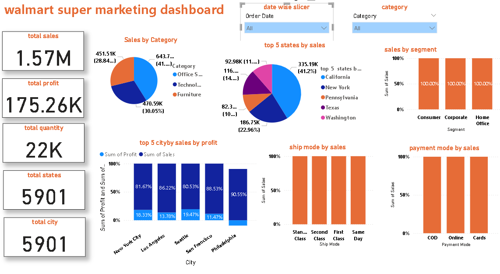

```markdown
# 🛒 Walmart Super Marketing Dashboard

This repository contains a comprehensive **Power BI Dashboard** that analyzes Walmart's superstore sales data. The dashboard provides deep insights into key performance metrics such as total sales, profits, quantity sold, and geographic performance. It is designed for business users to track KPIs and make informed marketing and sales decisions.

---

## 🎯 Objective

The primary objective of this project is to:

- Provide a **centralized view** of Walmart’s sales and marketing performance.
- Enable **data-driven decision making** by analyzing customer segments, geographic trends, product categories, and shipping modes.
- Help stakeholders **identify profitable areas**, underperforming locations, and optimize operations accordingly.

---

## 📊 Dashboard Features

This dashboard offers the following features:

- 📌 **Total KPIs Displayed**:
  - Total Sales: **1.57M**
  - Total Profit: **175.26K**
  - Total Quantity Sold: **22K**
  - Unique States: **5901**
  - Unique Cities: **5901**

- 🧭 **Interactive Filters**:
  - Date-wise Slicer (Order Date)
  - Product Category Filter

- 🥇 **Top Performers**:
  - Top 5 States by Sales (e.g., California, New York)
  - Top 5 Cities by Profit & Sales (e.g., New York City, Los Angeles)

- 🛍️ **Sales by Category**:
  - Furniture, Office Supplies, Technology

- 🚚 **Shipping Insights**:
  - Ship Mode by Sales (Standard Class, First Class, Same Day)

- 💳 **Payment Insights**:
  - Sales by Payment Mode (COD, Online, Cards)

- 🧑‍🤝‍🧑 **Sales by Segment**:
  - Consumer, Corporate, Home Office

---

## 🛠️ Tools & Technologies

- Power BI (Data Visualization)
- Excel/CSV (Data Source)
- DAX (Data Analysis Expressions for calculations)

---

## 📁 Repository Structure

```

walmart\_super\_dashboard/
│
├── Walmart\_Super\_Store.pbix              # Power BI project file
├── walmart.png                           # Screenshot of the dashboard
├── README.md                             # Project overview and documentation
├── sales\_data.csv                        # Dataset used (if uploading)

```

---

## 🔍 Key Insights

- **California** alone accounts for over **40% of total sales**.
- **Technology** leads in product category sales (~41%).
- **Cards** and **Online** dominate as the preferred payment methods.
- **Standard Class** is the most commonly used shipping method.

---

## 🚀 Future Prospects

To improve and scale the dashboard:

- Integrate **real-time data** using API or scheduled data refresh.
- Add **forecasting models** for future sales and profit trends.
- Embed the dashboard into **web applications** or SharePoint.
- Include **customer feedback** or review sentiment for enhanced analytics.
- Create mobile-optimized reports using Power BI Mobile.

---

## 👨‍💻 Author

**Ankit Kumar**  
🎓 B.Tech - Artificial Intelligence & Data Science  
📍 Truba Institute of Engineering and Information Technology, Bhopal  
🌐 [Add your GitHub, LinkedIn, or portfolio URL here]

---

## 📜 License

This project is licensed for educational and professional portfolio use. Attribution is appreciated.

---

## 📷 Dashboard Preview



---

Want help deploying this dashboard on the web or integrating with Power BI Service? Feel free to reach out!
```

---

